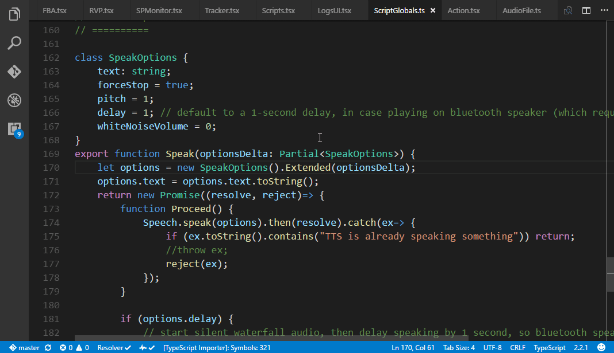

# VTools for Visual Studio Code

Extension install page: <https://marketplace.visualstudio.com/items?itemName=venryx.vscode-vtools>

## Features

### Auto-hide side-bar
Causes the side-bar to be hidden whenever the user clicks outside of it. (technically, when the user changes the text-editor selection)

### Auto-hide bottom-bar
Same thing as above, except for the bottom-bar (output, terminal, etc.).

## Settings

* `vtools.autoHideSideBar`: Causes the side-bar to be hidden whenever the user clicks outside of it. [boolean, default: `false`]
* `vtools.autoHideBottomBar`: Causes the bottom-bar (output, terminal, etc.) to be hidden whenever the user clicks outside of it. [boolean, default: `false`]
* `vtools.autoHideDelay`: How long to wait (after the user clicks outside of the side/bottom bar) before hiding it. (helps solve the unintended-selection issue -- especially when scrolled to the right) [number, default: `300`]

## Developing

1) Clone/download repo: https://github.com/Venryx/vscode-vtools.git
2) Make code changes in "src" folder.
3) Run "npm run compile". (this will start compiler in watch mode) [if editing in vscode, Ctrl+B also works]
4) Not sure what command to use in the command-line. In vscode, I open the Debug panel and launch the extension from there.

## Publishing

1) Increment the version number in package.json.
2) Run "npm publish".